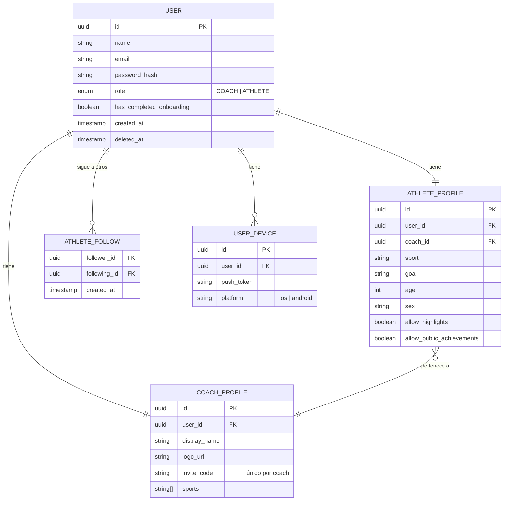
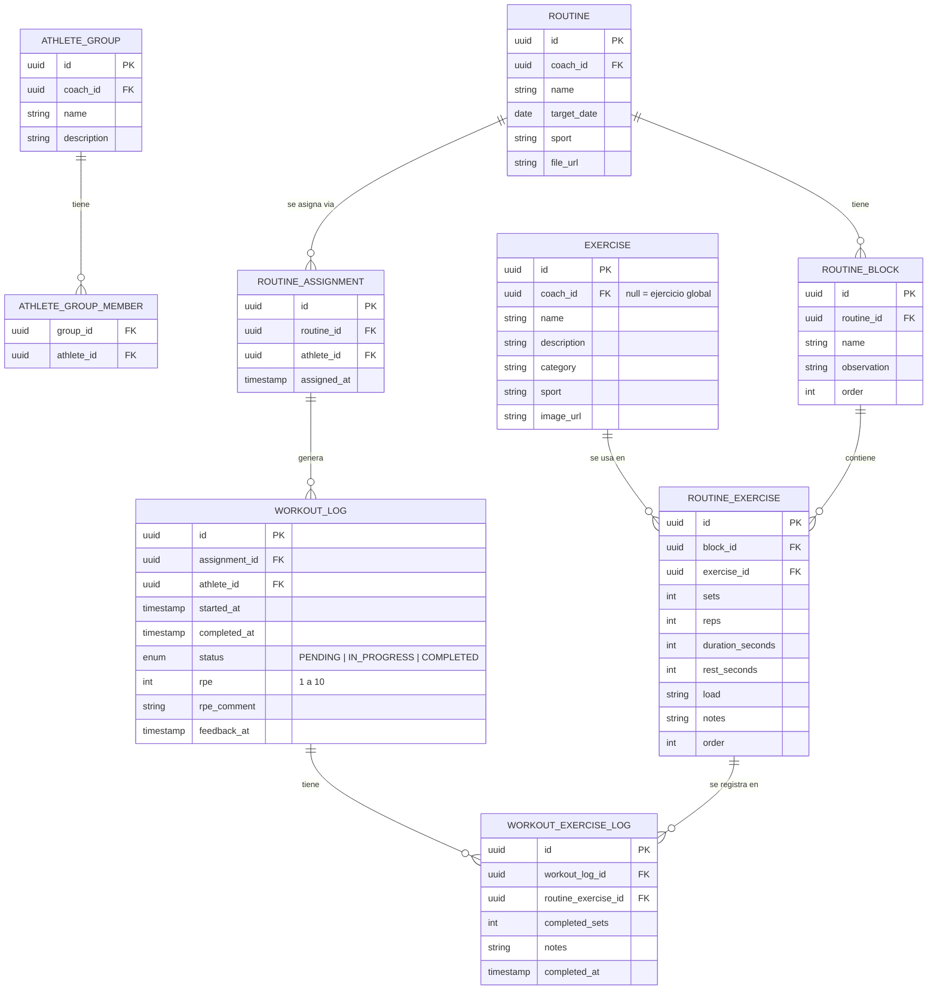
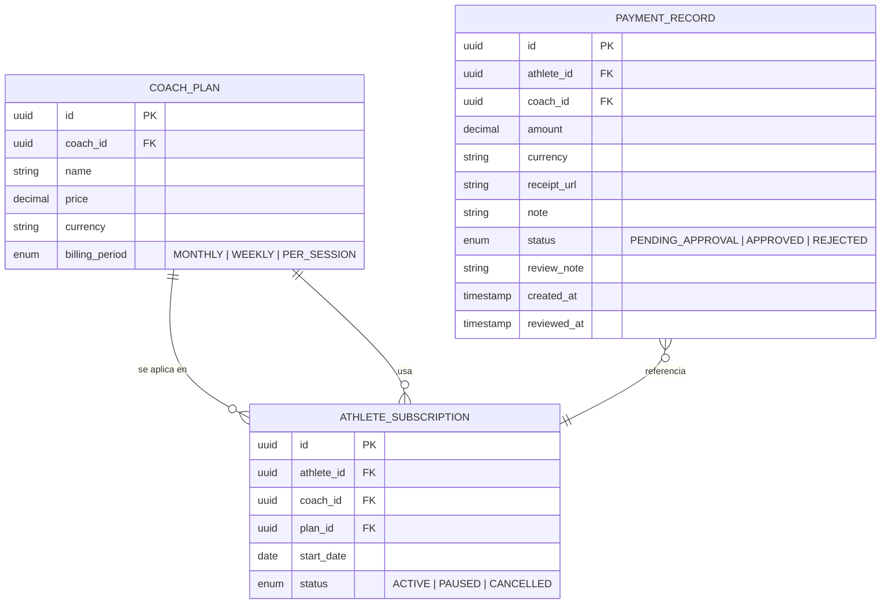
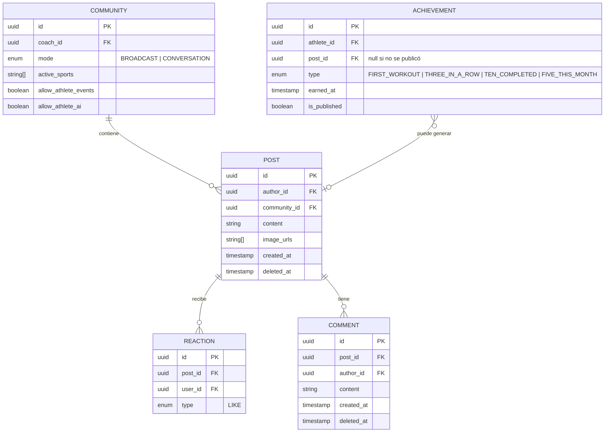
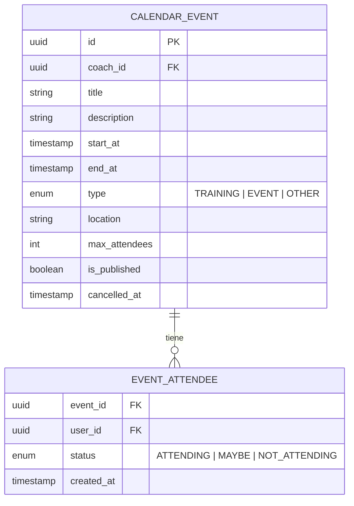
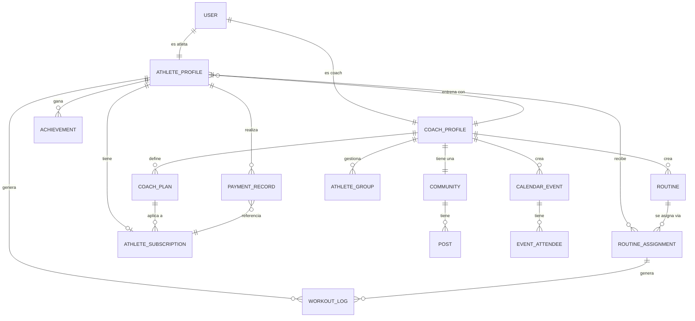

# Base de Datos — Athletica

Esquema de tablas y relaciones dividido por área. Es un modelo conceptual — los tipos exactos se definen cuando se arranque el desarrollo.

---

## 1. Usuarios y Perfiles

---

## 2. Entrenamiento

---

## 3. Pagos

---

## 4. Comunidad

---

## 5. Calendario

---

## Mapa de Relaciones General

Cómo se conectan todas las áreas entre sí:

