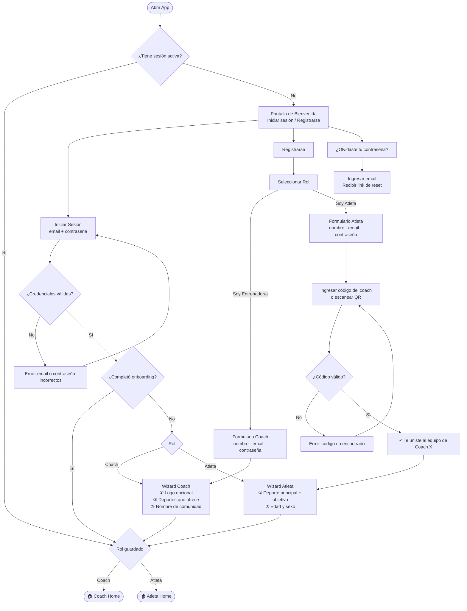
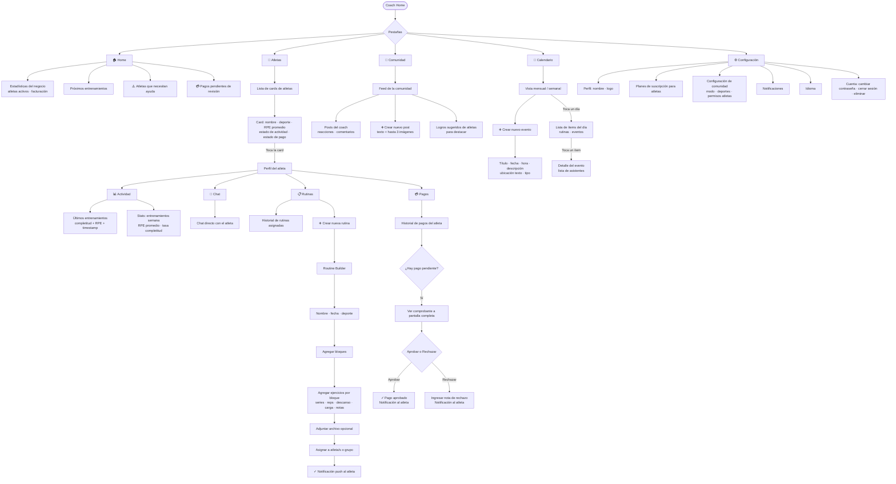
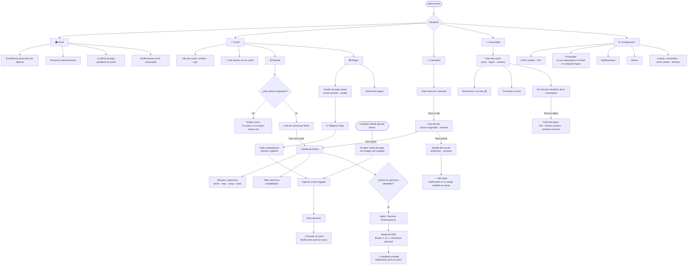
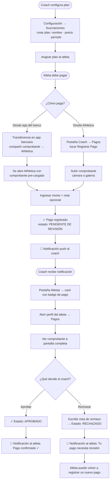
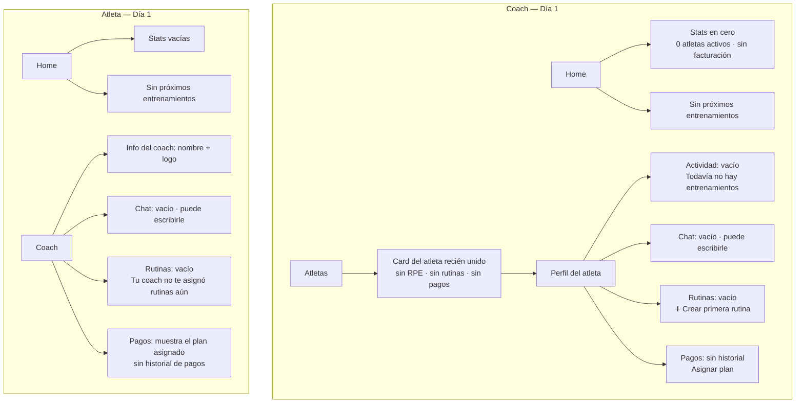

# Flujo de la Aplicación — Athletica

Diagramas de flujo completos por área. Usá estos como base para validar pantallas antes de arrancar el desarrollo.

---

## 1. Entrada y Autenticación

---

## 2. Flujo Coach — Navegación Principal

---

## 3. Flujo Atleta — Navegación Principal

---

## 4. Flujo de Pago — Completo (Coach + Atleta)

---

## 5. Estados Vacíos — Día 1 Post-Onboarding

Este es el estado de la app cuando el coach y el atleta se acaban de unir y no hay datos aún.

